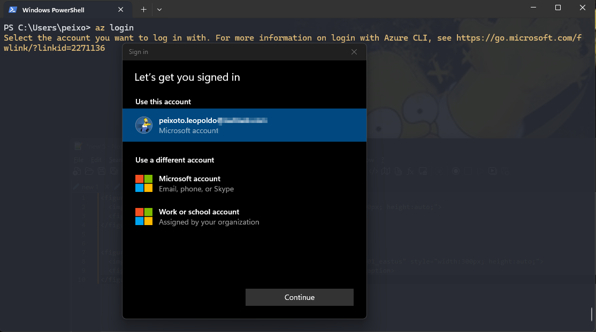
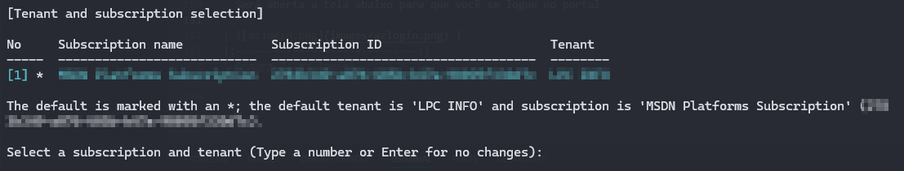

# Azure Kubenertes Services - AKS

 O Azure Kubernetes Services (AKS) é um serviço gerenciado da Microsoft Azure para orquestração de conteineres usando o kubernetes.

## Principais Caracteristicas do AKS

**1 - Gerenciamento Simplificado:**

- O control plane do Kubernetes é gerenciado pela Microsoft, incluindo atualizações, patches e escalabilidade, permitindo que os usuários foquem nas cargas de trabalho e menos na infraestrutura

**2 - Escalabilidade Automática:**

- Suporte para autoescalonamento de nós(nodes) e pods com base na demanda de recursos.

**3 - Integração com Azure:**

- Funciona de forma integrada com outros serviços do Azure, como Microsoft Entra ID e integração com ferramentas de segurança, como Azure Policy.

**4 - Custo-efetividade:**

- Você paga apenas pelos nós do cluster em execução, enquanto o plano de controle (control plane) é gratuito.

**5 - Segurança**

- Suporte para controle de acesso baseado em funções (RBAC).

- Autenticação via Microsoft Entra e integração com ferramentas de segurança como Azure Policy

**6 - Flexibilidade Multilingue:**

- Suporte para executar aplicativos em contêiners usando qualquer linguagem ou estrutura que possa ser contida em um contêiner Docker.

## Estrutura de recursos do AKS

Quando criamos um Cluster AKS, automaticamente um grupo de recursos gerenciado pela Microsoft é criado e normalmente é nomeado com o prefixo MC.

Dentro deste grupo de recursos gerenciado alguns componentes são criados para o funcionamento do AKS.

No exemplo abaixo vejam que criei o recurso aks-devlab01 no grupo de recursos *rg-aks-devlab01* e automaticamente foi criado um grupo de recurso chamado
*MC_rg-aks-devlab01_aks-devlab01_eastus*. 

Clicando na figura 1, podemos notar que foi criado o aks-devlab01 e clicando na figura 2 podemos visualizar que foram criados componentes gerenciados pela Microsoft.

É possível notar que o grupo de recursos *MC_rg-aks-devlab01_aks-devlab01_eastus* contém as tags informando qual cluster ele é gerenciado e em qual resource group ele se encontra.

|  |
|:-----------------------------:|
| Figura 1: rg-aks |


|  |
|:-----------------------------:|
| Figura 2: mc-rg-aks|


Os recursos criados automaticamente e gerenciados pela Micrososft são:

**1 - Virtual Machine Scale Set (VMSS):** 
- Utilizada para hospedar os nodes do cluster

**2 - Virtual Network (VNET):** 
- Representa a própria rede do Azure
- Proporciona isolamento e controle de tráfego
- Permite que os *Nós* e *PODs* do kubernetes se comuniquem de forma segura

**3 - Network Security Group:**
- Filtro de rede que pode conter várias regras de segurança
- Permite ou nega tráfego de rede para recursos conectados a VNET

**4 - Route Table:**
- Contém um conjunto de regras chamadas rotas que determina para onde o tráfego de rede deve ser direcioinado
- No AKS direciona o tráfego de rede entre os *PODs* e para fora do cluster

**5 - Load Balancer:**
- Usado para distribuir as solicitações de usuários entre diferentes instâncias de um serviço ou aplicação
- Garante desempenho e disponibilidade

**6 - Public IP:**
- Utilizado para expor serviços ao tráfego externo

**7 - Managed Identity**
- Fornece uma identidade do Microsoft Entra, gerenciada automaticamente pelo Azure
- No AKS é utilizada para conceder permissões de acesso aos *Nós* do cluster a outros recursos do Azure

## Tipos de Cluster AKS

No AKS podemos ter clusters públicos e privados.

### Caracteristicas do Cluster Público

- API Server com IP Público
- Integração direta com ferramentas de CI/CD
- Facilidade de integração
- Administração remota sem VPN
- Risco de exposição na internet
- Necessidade contínua de gestão de segurança

### Cluste Privado

- API Server com IP Privado
- Acesso restrito a rede privada do AKS
- Máxima segurança e conformidade
- Controle de acesso rigoroso 
- Complexidade Operacional
- Necessidade de VPN

## Nodes e Node Pool

- Um Node Pool é um conjunto de máquinas virtuais (*Nós*) homogêneas
- São provisionados para executar os *Nós* (Nodes) de um cluster kubenertes AKS
- Cada *Nó* executa contêineres e cargas de trabalho do Kuberentes

### Caracteristícas do Node Pool

**Escalabilidade:**
- É possível dimensionar horizontalmente um node pool adicionando ou removendo *Nós*

**Configuração flexível:**
- Cada node pool pode ter configurações diferentes, como tamanho de VM, tipo de VM e até versão do sistema operacional

**Isolamento de recursos:**
- É possível isolar recursos para diferentes cargas de trabalho no mesmo cluster AKS

**Atualização controlada:**
- Capacidade de atualizar ou fazer upgrade de um node pool separadament de forma controlada

**Balanceamento de carga:**
- Os nodes pools podem ser configurados com diferentes tipos de VMs para otimizar o balanceamento de carga para atender requisitos de desempenho.

### Tipos de Node Pool

**1 - Node Pool de Sistema(System Node Pool)**
- Reservado para os serviços do sistema kubernetes essenciais para o control plane

**2 - Node Pool de Usuário(User Node Pool)**
- Onde as cargas de trabalho são executadas
- Principal área onde os conteineres e os aplicativos serão aplicados

**IMPORTANTE**: Quando criamos o aks através do azure cli por default ele cria por default o o system node pool, como melhor prática devemos adicionar o user node pool.

## Um pouco de Mão na Massa, o famoso Hands on

Podemos criar um cluster aks no Azure acessando o portal.azure.com, através de linha de comando utilizando o Azure CLI, ou através do código terraform.

Irei demonstrar como criar um cluster aks com as configurações default utilizando o azure cli, considerando que você já tenha uma conta no Azure e o Azure CLI instalado, 
segue passo a passo:

**Passo 1:** Realizar o login no portal do azure através da linha de comando:
- az login
- Será aberta a tela abaixo para que você se logue no portal e logo após tela no terminal para selecionar a subscription caso, tenha mais de uma

|  |
|:-----------------------------:|
| Figura 3: az login|


|  |
|:-----------------------------:|
| Figura 4: az login|

**Passo 2:** Após realizar o login criar o resource group com o seguinte comando:

```
 az group create -l eastus -n rg-aks-devlab01
 ```
