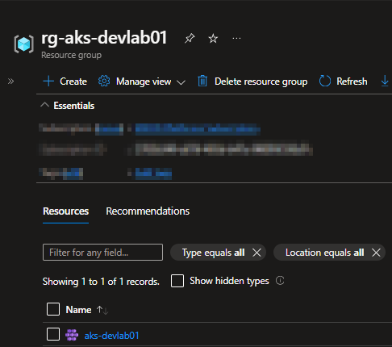
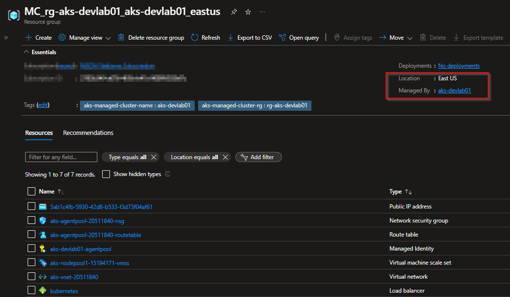

# Azure Kubenertes Services - AKS

 O Azure Kubernetes Services (AKS) é um serviço gerenciado da Microsoft Azure para orquestração de conteineres usando o kubernetes.

## Principais Caracteristicas do AKS

 **1 - Gerenciamento Simplificado:**

 - O control plane do Kubernetes é gerenciado pela Microsoft, incluindo atualizações, patches e escalabilidade, permitindo que os usuários foquem nas cargas de trabalho e menos na infraestrutura

**2 - Escalabilidade Automática:**

- Suporte para autoescalonamento de nós(nodes) e pods com base na demanda de recursos.

**3 - Integração com Azure:**

- Funciona de forma integrada com outros serviços do Azure, como Microsoft Entra ID e integração com ferramentas de segurança, como Azure Policy.

**4 - Custo-efetividade:**

- Você paga apenas pelos nós do cluster em execução, enquanto o plano de controle (control plane) é gratuito.

**5 - Segurança**

- Suporte para controle de acesso baseado em funções (RBAC).

- Autenticação via Microsoft Entra e integração com ferramentas de segurança como Azure Policy

**6 - Flexibilidade Multilingue:**

- Suporte para executar aplicativos em contêiners usando qualquer linguagem ou estrutura que possa ser contida em um contêiner Docker.

## Estrutura de recursos do AKS

Quando criamos um Cluster AKS, automaticamente um grupo de recursos gerenciado pela Microsoft é criado e normalmente é nomeado com o prefixo MC.

Dentro deste grupo de recursos gerenciado alguns componentes são criados para o funcionamento do AKS.

No exemplo abaixo vejam que criei o recurso aks-devlab01 no grupo de recursos *rg-aks-devlab01* e automaticamente foi criado um grupo de recurso chamado *MC_rg-aks-devlab01_aks-devlab01_eastus*. 

*rg-aks-devlab01*

*MC_rg-aks-devlab01_aks-devlab01_eastus*

